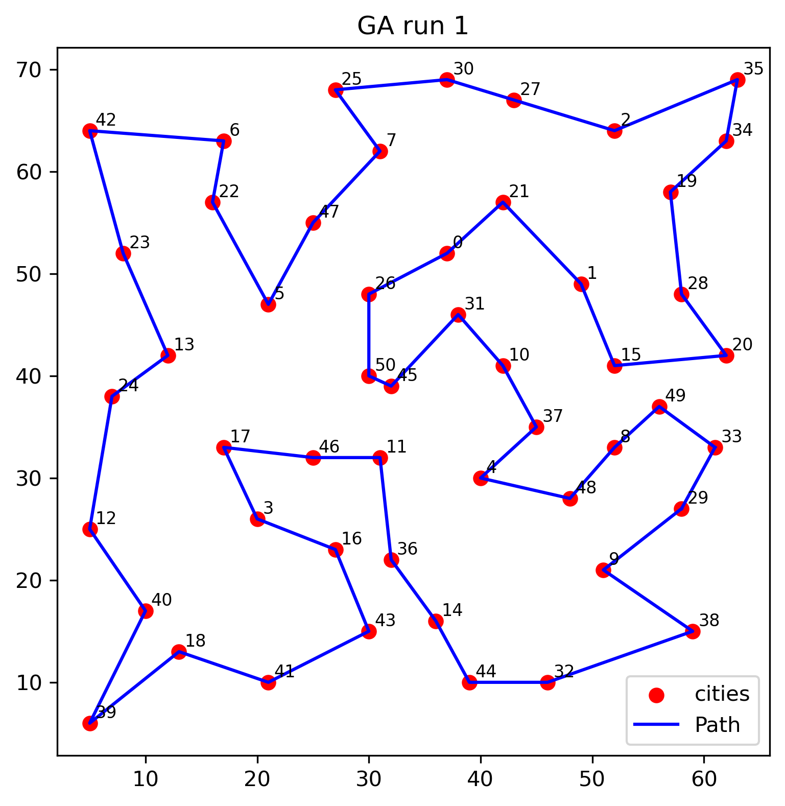
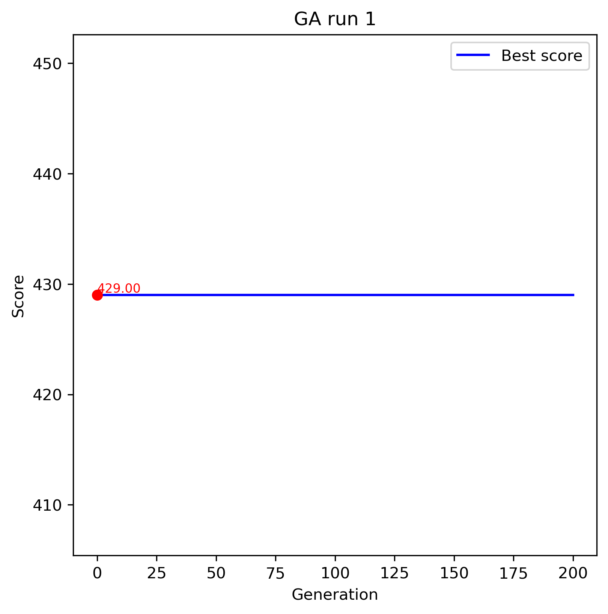
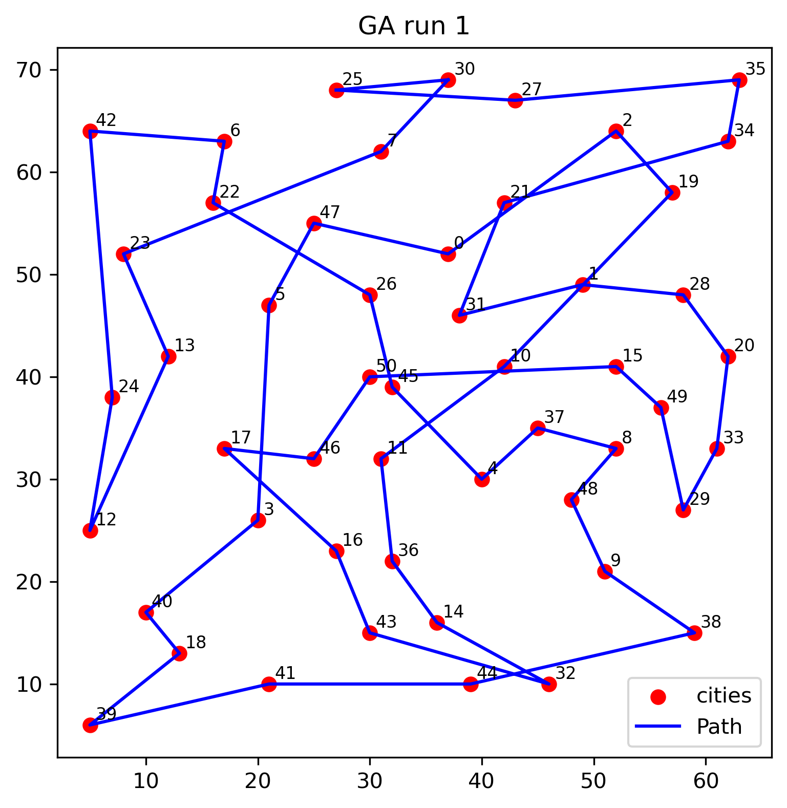
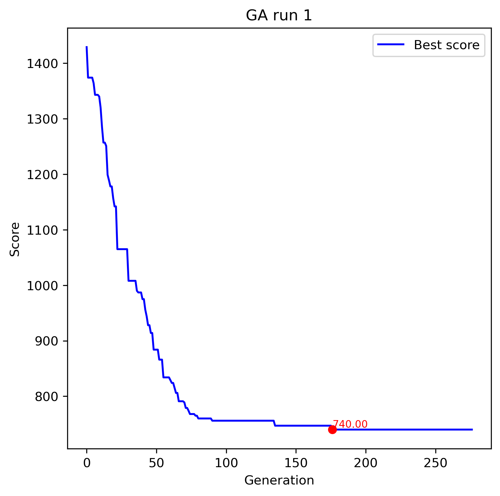

# GA với Mã hóa Hoán vị
- Lựa chọn (Selection):
    - Tournament Selection
    - Roulette Wheel Selection

- Lai ghép (Crossover):
    - Order Crossover (OX)
    - Partially Mapped Crossover (PMX)

- Đột biến (Mutation):
    - Swap Mutation (hoán đổi 2 gene)
    - Inversion Mutation (đảo ngược một đoạn gene)

## Kết quả minh họa
1. Roulette + PMX Crossover + Inversion Mutation  
    
    

2. Tournament + OX Crossover + Swap Mutation  
    
    

# GA với Mã hóa Số thực
- Ý tưởng mã hóa
    - Mỗi cá thể là một vector số thực trong [0,1].
    - Khi giải mã (decode), ta sắp xếp vector để thu được thứ tự thành phố (tour).

- Lai ghép (Crossover):
    - Simulated Binary Crossover (SBX)
- Đột biến (Mutation):
    - Polynomial Mutation
    - Gaussian Mutation

## Kết quả minh họa
1. Real-coded + Polynomial Mutation  
    
    

2. Real-coded + Gaussian Mutation  
    
    

# Kết quả minh họa tour tối ưu .opt.tour
